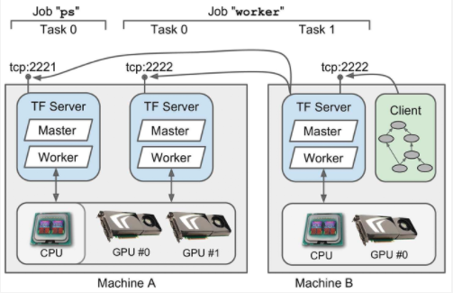
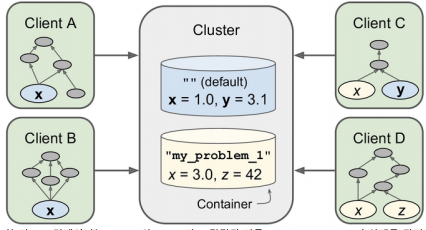
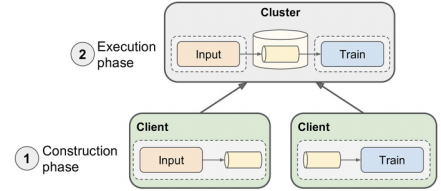
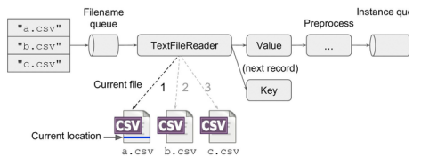
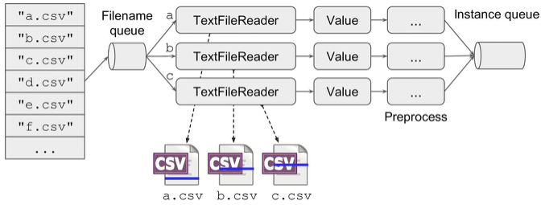

# Chapter 12 – Distributed TensorFlow

12장에서는 텐서플로를 이용하여 여러장치에서 계산을 분산하고 병렬을 실행하는 방법에 대해 다룬다

텐서플로의 분산 컴퓨팅은 다른 신경망 프레임워크와 비교할 때 주요 기능 중 하나로 계산 그래프 (computation graph)를 장치와 서버에 나누는 방법을 완벽하게 제어 할 수 있다. 모든 병렬 처리 방법들을 선택적으로 할 수 있어, 유연하게 작업(operation)을 병렬화하고 동기화 할 수 있다. 

신경망의 실행과 학습을 병렬화하여 학습알고리즘이 완료되기까지 몇 주가 걸릴 수도 있는 작업을 몇시간만에 학습할 수 있다. (시간절약 효과적)<br>

<병렬화의 유용성>
- 다양한 모델을 훨씬 쉽게 테스트 할 수 있다 : 모델을 새로운 데이터로 자주 재 학습 할 수 있다는 것을 의미
- 모델을 미세 조정(fine-tuning) 할 때, 훨씬 더 큰 파라미터 범위를 탐색하고 신경망의 대규모 앙상블을 효율적으로 실행할 수 있다.

# Setup

First, let's make sure this notebook works well in both python 2 and 3, import a few common modules, ensure MatplotLib plots figures inline and prepare a function to save the figures:


```python
# To support both python 2 and python 3
from __future__ import division, print_function, unicode_literals

# Common imports
import numpy as np
import os

# to make this notebook's output stable across runs
def reset_graph(seed=42):
    tf.reset_default_graph()
    tf.set_random_seed(seed)
    np.random.seed(seed)

# To plot pretty figures
%matplotlib inline
import matplotlib
import matplotlib.pyplot as plt
plt.rcParams['axes.labelsize'] = 14
plt.rcParams['xtick.labelsize'] = 12
plt.rcParams['ytick.labelsize'] = 12

# Where to save the figures
PROJECT_ROOT_DIR = "."
CHAPTER_ID = "distributed"

def save_fig(fig_id, tight_layout=True):
    path = os.path.join(PROJECT_ROOT_DIR, "images", CHAPTER_ID, fig_id + ".png")
    print("Saving figure", fig_id)
    if tight_layout:
        plt.tight_layout()
    plt.savefig(path, format='png', dpi=300)
```

# Local server


```python
import tensorflow as tf
```


```python
c = tf.constant("Hello distributed TensorFlow!")
server = tf.train.Server.create_local_server()
```


```python
with tf.Session(server.target) as sess:
    print(sess.run(c))
```

    b'Hello distributed TensorFlow!'
    

## 1. Multiple Devices on a Single Machine
이 섹션에서는 텐서플로가 한 대의 컴퓨터에서 여러 개의 GPU카드를 사용할 수 있도록 환경 설정하는 방법에 대해 살펴보고자 한다. <br>
그런 다음, 사용 가능한 장치간에 작업을 분산하고, 동시에 실행할 수 있는 방법을 살펴보고자 한다. 


### 1.1 Installation 
    1) 여러 GPU 카드에서 텐서플로우를 실행하려면 먼저 GPU카드에 NVidia Compute Capability (3.0이상)가 있는지 확인해야 한다.
    Nvidia의 Titan, Titan X, K20, K40카드가 포함
    다른 카드를 소유하고 있다면 https://developer.nvidia.com/cuda-gpus 에서 호환성 확인 가능
    
    GPU카드가 없을 때 "Amazon AWS"와 같은 GPU기능이 있는 호스팅 서비스를 사용할 수 있다. 
    또한 구글을 TensorFlow 그래프를 실행하기 위해, "Cloud Machine Learning"이라는 클라우드 서비스도 출시했다.
    2016년 5월 그들은 플랫폼에 텐서 프로세싱 유닛(TPU)이 장착 된 서버와 많은 머신러닝 작업에서 GPU보다 훨씬 빠른 기계 학습 전용 프로세서를 포함한다고 발표했다

    2)  적절한 버전의 CUDA 및 cuDNN 라이브러리(텐서플로 1.0.0의 바이너리 설치를 사용하는 경우 CUDA 8.0 및 cuDNN 5.1)를 다운로드하여 설치 및 텐서플로가 CUDA 및 cuDNN을 찾을 수 있도록 몇 가지 환경 변수를 설정 (설치지침은 텐서플로 웹사이트 지침을 따르기)


    
    엔비디아의 CUDA(Compute Unified Device Architecture) 라이브러리를 사용하면 개발자가 그래픽 가속 뿐만 아니라, 모든 종류의 계산에 CUDA-enabled GPUs를 사용할 수 있다. 엔비디아의 CUDA Deep Neural Network library(cuDNN)는 DNN을 위한 GPU 가속화를 위한 라이브러리이다.
    
    이것은 활성화 레이어(activation layers), 정규화(normalization), 순/역전파 컨볼루션(forward and backward convolution), 풀링(pooling)과 같은 일반적인 DNN 계산의 최적화 된 구현을 제공한다. 
    
    이는 엔비디아의 Deep Learning SDK에 포함되어 있다. (다운로드 시 엔비디아 개발자 계정 필요) 텐서플로우는 CUDA 및 cuDNN을 사용하여 GPU카드를 제어하고 계산을 가속화 한다. 
    
    3) 콘솔창에서 사용 가능한 GPU카드, 각 카드에서 실행 중인 프로세스를 확인하고 GPU가 지원되는 텐서플로우를 설치한다. 
     virtualenv를 사용하여 격리 된 환경을 만든 경우, 먼저 활성화 해야한다. 
     파이썬 쉘을 열어 텐스플로우를 import한 후, 세션을 생성하여 텐서플로우가 CUDA와 cuDNN을 올바르게 감지하고 사용하는지 확인할 수 있다.

### 1.2 Managing the GPU RAM
텐서플로는 처음 그래프를 실행할 때 사용 가능한 모든 GPU의 모든 RAM을 자동으로 가져오므로 첫 번째 텐스플로 프로그램이 실행 중일 때, 두 번째 텐서플로 프로그램을 시작할 수 없고 시도하면 아래와 같은 오류가 발생한다. 


**첫번째 해결책**<br>
각 프로세스를 다른 GPU카드에서 실행한다. <br>
이렇게 하기위한 가장 간단한 옵션은 CUDA_VISIBLE_DEVICES 환경 변수를 설정하여 각 프로세스가 해당 GPU카드만 볼 수 있도록 하는 것이다.

프로그램1은 GPU카드 0과 1에서만, 프로그램2는 GPU카드 2와3에서만 볼 수 있다.

**두번째 해결책**<br>
 텐서플로우에게 메모리의 일부만 할당하도록 지시한다.<br>
 예를 들어, 텐서플로우가 각 GPU메모리의 40%만 할당하도록 하려면 `ConfigProto` 객체를 만들고, `gpu_options.per_process_gpu_memory_fraction`옵션을 0.4로 설정하고 다음 구성을 사용하여 세션을 생성해야 한다. (각 카드의 총 RAM 용량의 40%를 차지)


**세번째 해결책**<br>
 텐서플로우에게 필요할 때만 메모리를 확보하도록 지시한다. <br>
 이렇게 하려면 config.gpu_options.allow_growth를 True로 설정해야 한다. <br>
 이 방법의 단점은 메모리 확보후 메모리를 방출하지 않아 메모리가 부족해져 결정적인 활동을 보장하기가 어렵기 때문에 이전 옵션을 사용하는 것이 좋다. 

### 1.3 Placing Operation on Devices
 텐서플로의 whitepaper는 그래프의 이전 실행에서 측정 된 계산 시간, 각 작업(operation)에 대한 입력 및 출력 텐서의 크기, 각 장치에서 사용
할 수 있는 RAM의 양, 장치로부터 데이터가 오고 갈 때의 통신 지연 등 이러한 것들을 고려하여 사용 가능한 모든 장치에서 작업을 자동으로 배
포하는 **동적 배치(dynamic placer) 알고리즘**을 제공 -> 아직 출시되지 않음

대신 아직까지는 simple placer에 의존한다. 

### 1.3.1 Simple Placement
그래프를 실행할 때마다 텐서플로우는 아직 장치에 배치되지 않은 노드를 평가해야하는 경우 simple placement를 사용하여 배치하고 아직 배치
되지 않은 다른 모든 노드를 배치한다. 
- 이전 그래프 실행에서 노드가 이미 장치에 배치 된 경우, 노드는 해당 장치에 남아 있다. 
- 그렇지 않으면, 사용자가 노드를 장치에 고정하면 placer가 해당 장치에 노드를 배치한다.
- 그렇지 않으면, GPU 0으로 기본 설정된다. GPU가 없으면 CPU가 기본값으로 설정된다. 

    적절한 장치에 작업을 배치하는 것은 대부분 사용자에게 달려있다. 아무것도 하지 않으면 전체 그래프가 기본 장치에 배치된다. 
    노드를 장치에 고정하려면, device() 함수를 사용하여 장치 블록을 만들어야 한다. 예를 들어 다음 코드는 변수 a와 상수 b를 CPU에 고정하지만,
    모든 장치에 곱셈 노드c가 고정되어 있지 않으므로, 기본 장치에 배치된다. 


### 1.3.2 logging placements
 simple placer가 방금 정의한  placement constraints를 준수하는지 확인한다. `log_device_placement`옵션을 `True`로 설정할 수 있다. <br>
 이는 placer에게 노드를 배치 할 때마다, 메시지를 기록하도록 지시한다
 
 
 - I로 시작하는 행은 로그메세지 : 
   Create TensorFlow device(/gpu:0) -> (device :0, name:GRID K520, pci bus id : 0000: 00: 03.0) <br>
-> 텐서플로는 GPU카드(GRID K520)를 찾았다고 메세지를 기록<br>
- 그런다음 처음으로 그래프를 실행하면(이 경우 변수 a를 초기화 할 때) simple placer가 실행되고 각 노드가 할당 된 장치에 배치<br>
- 로그 메시지는 기본 노드인 "/gpu:0"에서 끝나는 곰셈 노드를 제외하고 모든 노드가 "/cpu:0"에 배치되었음을 보여준다. 

 - 그래프를 실행하면(c를 계산할 때) 텐서플로우가 계산해야하는 모든 노드가 이미 배치되었으므로, placer가 사용되지 않는다. 

### 1.3.3 Dynamic Placement Function
 장치 블록을 만들 때, 장치 이름 대신 함수를 지정할 수도 있다. <br>
 텐서플로는 장치 블록에 배치해야하는 각 작업(operation)에 대해 해당 함수를 호출하고, 함수는 작업을 고정하기 위해 장치의 이름을 반환해야 한다. 
 
 예를 들어, 다음 코드는 모든 변수 노드를 "/cpu: 0" (이 경우 변수 a) 및 기타 모든 노드를 "/gpu:0"에 고정한다.


### 1.3.4 Operations and Kernels
 장치에서 텐서플로 작업을 실행하려면 해당 장치에 대한 구현(implementation)이 필요하고 이를 *kelnel* 이라고 한다. 
 
 많은 작업에는 CPU와 GPU 모두에 커널이 있지만 전부 그렇지는 않다. <br>
 예를 들어, 텐서플로우에는 정수 변수(integer variables)에 대한 GPU 커널이 없으므로 텐서플로우가 변수 i를 GPU 0에 배치하려고 하면 아래와 같이 fail이 발생한다. 
 
 
 
 텐서플로우는 초기화 값이 정수이므로 변수가 반드시 int32 타입이어야 한다.<br>
 만약 3대신 초기화 값을 3.0으로 변경하고자 한다면, 변수를 만들 때 dtype=tf.float32를 명시적으로 설정하면 제대로 작동한다. 


### 1.3.5 Soft Placement
장치에대한 operation에 kernel이 없는 경우 operation을 장치에 고정시키려 하면 Tensorflow가 작업을 시도할 때 이전에 발생했던 오류가 발생한다. <br>
대신 Tensorflow가 CPU로 대체되는것을 선호할 경우 `allow_soft_placement` 구성옵션을 True로 설정할 수 있다.


## 1.4 Parallel Execution
- 텐서플로는 그래프를 실행할 때, 평가 될 필요가 있는 노드 목록을 찾아 내어 시작하고, 각각의 종속성이 몇 개인지 계산한다.
- 텐서플로우는 종속성이 없는 노드(즉, source nodes) 를 평가한다.
- 이러한 노드가 별도의 장치에 배치되면 작업은 병렬로 처리된다. 
- 동일한 장치에 배치되면 서로 다른 thread에서 처리되므로 GPU thread 또는 CPU 코어에서 병렬로 실행 될 수도 있다. 
- 텐서플로우는 각 장치의 thread pool을 관리하여 작업을 병렬 처리한다.


예를 들어 위의 그림에서 작업 A, B, C 는 source operations이기 때문에 즉시 평가 할 수 있다.<br> 
작업(연산) A,B는 GPU 0에 배치되므로 이 장치의 inter-op thread pools로 보내지고 즉시 병렬로 처리된다. <br>
작업 A는 multithreaded kernel을 사용하기 때문에 세 부분으로 나뉘게 되며, 이는 intra-op thread pools에 의해 병렬로 실행된다. <br>
작업 C는 GPU #1의 inter-op thread pools로 이동한다. <br>
 작업 C가 완료되면 D와 E의 종속성 카운터가 감소되어 모두 0에 도달하기때문에, 두 작업이 모두 실행을 위한 inter-op thread pools로 보내지게
된다. 

### 1.5 Control Dependencies
어떤 경우는 모든 작업이 실행되었더라도 작업의 평가를 연기하는 것이 좋다. <br>
예를 들어, 장치 외부에 있는 데이터에 의존하는 일련의 작업이 있다. <br>
모두가 동시에 실행되면 장치의 통신 대역폭이 포화 상태가 되어 I/O를 기다리는 상태가 된다.<br> 
또한, 데이터를 통신해야 하는 다른 작업도 차단된다. <br>
이러한 작업에서는 무거운 동작을 순차적으로 실행하여 장치가 병렬로 다른 동작을 수행하는 것이 바람직 할 것이다. <br>
 일부 노드의 평가를 연기하려면 제어 종속성(control dependencies)을 추가하는 것이 간단한 솔루션이다. <br>
예를 들어, 아래 코드는 a와 b가 평가 된 후에만 텐서플로우가 x와 y를 평가하도록 지시한다. 


 분명히 z는 x와 y에 의존하기 때문에 z를 평가하는 것은 control_dependencies() 블록에 명시적으로 되어 있지 않더라도, a와 b가 평가 될 때까지
기다리는 것을 의미한다. 

또한 b 가 a에 의존하기 때문에 [a,b] 대신 [b]에 대한 제어 종속성을 작성하여 앞의 코드를 단순화 시킬 수 있지만 경우에 따라 암시적인 것보다 명시적인것이 좋다. 

## 2.Multiple Devices Across Multiple Servers

- 여러서버에서 그래프를 실행하려면 먼저 클러스터를 정의해야 한다.
- 클러스터는 일반적으로 여러 시스템에 분산되어 있는, 하나 이상의 텐서플로우 서버(task)로 구성된다.
- 각 task는 job에 속한다. job은 일반적으로 모델 파라미터 변수( 파라미터 서버의 경우 "ps"로 이름이 지정됨)를 계산하나, 계산을 수행하는 것과 같은 공통된 역할을 하는 task 그룹이다.(job의 이름은 일반적으로 "worker"로 명명됨)



- 아래 클러스터 스펙은 하나의 task 와 두 개의 task를 각각 포함하는 두 개의 jobs "ps"와 "worker"를 정의.
- "machine-a" 는 서로 다른 포트에서 수신 대기하는 두 개의 텐서플로우(task)를 호스팅한다.
- 하나는 "ps" job의 일부이고, 다른 하나는 "worker" job의 일부이다. 
- "machine-b" 는 "worker" job의 일부인 텐서플로우 서버 하나를 호스팅한다.

$$cluster_spec = tf.train.ClusterSpec({ 
        "ps": ["machine-a.example.com: 2221", # /job:ps/ task: 0 ], 
        "worker": [
            "machine-a.example.com: 2222", # /job:worker/ task: 0 
            "machine-b.example.com: 2222", # /job:worker/ task: 1 
        ]})$$

- 텐서플로우 서버를 시작하려면 서버 개체를 만들어 클러스터 스펙(다른서버와 통신 할 수 있도록)과 자체 job 이름 및 job의 번호를 전달해야 한다.
- (예) 첫 번째 worker task를 시작하려면 machine-a 에서 다음 코드를 실행해야 한다.

**sever = tf.train.Server(cluster_spec, job_name = "worker", task_index = 0)**

- 일반적으로 머신 당 하나의 task만 실행하는 것이 더 간단하지만, 위의 예제에서는 텐서플로우를 사용하여 원하는 경우, 동일한 머신에서 여러개의 task를 시행 할 수 있음으로 보였다.
- 만약, 한 대의 머신에서 여러개의 서버가 있는 경우, 모든 GPU의 RAM을 모두 차지 않도록 해야한다.

(예)위의 그림에서  "ps" task는 GPU 디바이스를 볼 수 없다. 아마도 그 프로세스가<br> 
CUDA_VISIBLE_DIVICES = ""로 시작되었기 때문이다. --->(?) **#부가 설명필요**<br>
CPU는 동일한 머신에 있는 모든 task가 공유 된 다는 것을 기억하자. 프로세스가 텐서플로우 서버를 실행하는 것 외에 아무 일도 하지 않으려면, join() 메소드를 사용
하여 서버가 끝날 때까지 대기하도록 main thread를 차단할 수 있다. (그렇지 않으면 서버가 main thread를 종료). 현재 서버를 중단 시킬 방법이 없으므로 실제로 차단된다. 

**server.join()** #blocks until the server stops


# Cluster


```python
cluster_spec = tf.train.ClusterSpec({
    "ps": [
        "127.0.0.1:2221",  # /job:ps/task:0
        "127.0.0.1:2222",  # /job:ps/task:1
    ],
    "worker": [
        "127.0.0.1:2223",  # /job:worker/task:0
        "127.0.0.1:2224",  # /job:worker/task:1
        "127.0.0.1:2225",  # /job:worker/task:2
    ]})
```


```python
task_ps0 = tf.train.Server(cluster_spec, job_name="ps", task_index=0)
task_ps1 = tf.train.Server(cluster_spec, job_name="ps", task_index=1)
task_worker0 = tf.train.Server(cluster_spec, job_name="worker", task_index=0)
task_worker1 = tf.train.Server(cluster_spec, job_name="worker", task_index=1)
task_worker2 = tf.train.Server(cluster_spec, job_name="worker", task_index=2)
```

### 2.1 Opening a Session
모든 task가 시작되어 실행 중이면 모든 서버의 모든 프로세스에 있는 클라이언트에서 세션을 열 수 있으며, regular local session과 같은 세션을 이용할 수 있다.

(예)
$$a = tf.constant(1.0)
b = a + 2
c = a * 3
with tf.Session("grpc://machine-b.example.com:2222") as sess:
print(c.eval())    # 9.0$$


- 이 클라이언트 코드는 먼저 간단한 그래프를 만든 다음, machine-b에 있는 텐서플로우를 서버에서 세션을 열고(master라고 부름)C를 평가하도록 지시.
- 마스터는 operations을 적절한 장치에 배치하여 시작.
- 위 예에서는 어떤 장치에서든 operation을 고정하지 않았으므로 마스터는 모든 장치를 자체 기본 장치에 배치하기만 하면 된다.(machine-b의 GUP장치)
- 그런 다음, 클라이언ㅇ트가 지시한대로 c를 평가하고 결과를 반환한다.

### 2.2 The Master and Worker Services
클라이언트는 gRPC 프로토콜을 사용하여 서버와 통신한다.
이것은 원격 기능을 호출하고 다양한 플랫폼과 언어로 출력물을 얻는 효율적인 오픈소스 프레임워크이다. HTTP2를 기반으로 connection을 열어, 전체 세션동안 연결이 설정되면 효율적인 양방향 통신을 허용한다.
데이터는 다른 공개 소스 구글 기술인 프로토콜 버퍼의 형태로 전송된다.-> 가벼운 binary 데이터 교환 형식

**[warning]**
텐서플로우 클러스터의 모든 서버는 클러스터의 다른 서버와 통신 할 수 있으므로 방화벽의 적절한 포트를 열어야 한다.

**(?) 부가설명필요**

- 모든 텐서플로우 서버는 master 와 worker 서비스라는 두 가지 서비스를 제공
- 마스터 서비스를 사용하면 클라이언트가 세션을 열고 그래프를 실행하는데 사용 할 수 있음
- task 전반에 걸친 계산을 조정하고 worker 서비스를 사용하여 다른 task에 대한 계산을 실행하고 그 결과를 얻는다.
- 이러한 구조는 많은 유연성을 제공한다. 한 클라이언트는 아른 thread에서 여서 세션을 열어 여러서버에 연결할 수 있다.
- 하나의 서버가 하나 이상의 클라이언트에서 동시에 여러 세션을 처리할 수 있다.
- 하나의 task 당 하나의 클라이언트를 실행하거나 하나의 클라이언트에서만 모든 task를 제어할 수 있다.

### 2.3 Pinning Operations Across Tasks
- 장치 블록을 사용하여 job 이름, task index, device type, device index를 지정하여 모든 task를 관리하는 모든 장치에서 operation을 고정할 수 있다. 
  - 예를 들어 아래의 코드는 "ps" job(머신 A의 CPU)에서 첫 번째 task의 CPU에 a 핀을 지정한다.  
  - 다음으로 "worker" job의 첫 번째 task(머신 A의 GPU #1)에 의해 관리 되는 두 번째 GPU에 b를 고정한다. 
  - 마지막으로 c는 모든 장치에 고정되어 있지 않으므로 마스터가 자체 장치(머신 B의 GPU #0 device)에 배치한다.

# Pinning operations across devices and servers


```python
reset_graph()

with tf.device("/job:ps"):
    a = tf.Variable(1.0, name="a")

with tf.device("/job:worker"):
    b = a + 2

with tf.device("/job:worker/task:1"):
    c = a + b
```


```python
with tf.Session("grpc://127.0.0.1:2221") as sess:
    sess.run(a.initializer)
    print(c.eval())
```

    4.0
    

### 2.4 Sharding Vatiables Across Multiple Parameter Servers
- 분산 된 환경에서 신경망을 학습할 때, 일반적인 패턴은 파라미터 서버 집합(즉,  "ps" job의 task)에 모델 파라미터를 저장하는 반면, 다른 task들은 계산에 포커스를둔다. (즉, 'worker" job의 task)
- 수 백만 개의 파라미터가 있는 대형 모델의 경우, 단일 파라미터 서버의 네트워크 카드가 포화 될 위험을 줄이기 위해 이러한 파라미터를 여러 파라미터 서버에 분할 하는 것이 좋다. 
- 모든 변수를 다른 파라미터 서버에 수동으로 고정하려면 이는 매우 지루한 작업이 될 수 있다. 다행스럽게도 텐서플로우는 모든 "ps" task에 걸쳐 라운드 로빈 방식으로 변수를 배포하는 replica_device_setter() 함수를 제공한다. 
- 예를 들어, 아래의 코드는 5개의 변수를 2개의 파라미터 서버에 연결한다.

$$with tf.device(tf.train.replica_device_setter(ps_tasks=2):
v1 = tf.Variable(1.0) #pinned to /job:ps/task:0
v2 = tf.Variable(2.0) #pinned to /job:ps/task:1
v3 = tf.Variable(3.0) #pinned to /job:ps/task:0
v4 = tf.Variable(4.0) #pinned to /job:ps/task:1
v5 = tf.Variable(5.0) #pinned to /job:ps/task:0$$

- ps_tasks의 수를 전달하는 대신 cluster spec을 cluster = cluster_spec으로 전달 할 수 있으며, 텐서플로우는 단순히 "ps" job의 task의 수를 계산한다. 
- 블록에서 변수 이외의 다른 operation을 만들면 텐서플로우가 자동으로 "/job:worker"으로 고정한다. 이것은 worker의 첫 번째 task에서 관리하는 첫 번째 장치로 기본 설정된다. worker_device 파라미터를 설정하여 다른 장치에 고정 할 수 있지만, 더 좋은 방법으로 포함된 장치 블록을 사용하는 것이다. 내부 장치 블록은 외부 블록에 정의 된 job, task 또는 device를 무시 할 수 있다.


**[NOTE]**
- 아래코드에서는 파라미터 서버가 CPU 전용이라고 가정한다.
- 일반적으로 파라미터 서버는 파라미터 변수를 저장하고 전달하기만 하면 되므로 집중적으로 과도한 계산을 수행하지는 않는다.


```python
reset_graph()

with tf.device(tf.train.replica_device_setter(
        ps_tasks=2,
        ps_device="/job:ps",
        worker_device="/job:worker")):
    v1 = tf.Variable(1.0, name="v1")  # pinned to /job:ps/task:0 (defaults to /cpu:0)
    v2 = tf.Variable(2.0, name="v2")  # pinned to /job:ps/task:1 (defaults to /cpu:0)
    v3 = tf.Variable(3.0, name="v3")  # pinned to /job:ps/task:0 (defaults to /cpu:0)
    s = v1 + v2            # pinned to /job:worker (defaults to task:0/cpu:0)
    with tf.device("/task:1"):
        p1 = 2 * s         # pinned to /job:worker/task:1 (defaults to /cpu:0)
        with tf.device("/cpu:0"):
            p2 = 3 * s     # pinned to /job:worker/task:1/cpu:0

config = tf.ConfigProto()
config.log_device_placement = True

with tf.Session("grpc://127.0.0.1:2221", config=config) as sess:
    v1.initializer.run()
```

### 2.5 Sharding State Across Sessions Using Resource Containers

- local sesstion(not the distributed kind)을 사용하는 경우, 각 변수의 상태는 세션 자체에서 관리된다. 
- 세션이 종료되자마자 모든 변수 값은 사라진다. 또한 multiple local session은 동일한 그래프를 실행하더라도 상태를 공유할 수 없다. 
- 9장에서 논의했듯이, 각 세션에서는 모든 변수의 자체 복사본이 있다. 반대로 distributed sessions을 사용하는 경우, 변수 상태(variable state)는 세션이 아닌, resource containers에서 관리된다.
- 따라서 하나의 클라이언트 세션을 사용하여 x라는 변수를 만들면, 두 세션이 다른 서버에 연결되어 있어도 동일한 클러스터의 다른 세션에서 자동으로 사용할 수 있다. 
- 예를 들어, 아래 클라이언트 코드를 살펴보자.

$$#simple_client.py
import tensorflow as tf
import sys
x = tf.Variable(0.0, name = "x")
increment_x = tf.assign(x, x+1)
with tf.Session(sys.argv[1]) as sess:
if sys.argv[2:] == ["init"]:
sess.run(x.initializer)
sess.run(increment_x)
print(x.eval()) $$

-  텐서플로우 클러스터가 머신 A와 B, 포트 2222에서 작동하고 실행 중이라고 가정해보자. 클라이언트에서 머신 A의 서버와 세션을 열고 다음 명령을 실행하여 변수를 초기화하고 값을 증분하여 출력 할 수 있다.

**$ python3 simple_client.py grpc://machine-a.example.com:2222 init 1.0**

- 이제 클라이언트를 시작하면 머신 b의 서버에 연결되어 동일한 변수 x를 재사용한다.

**$ python3 simple_client.py grpc://machine-b.example.com:2222 2.0**         #클라이언트 시작


- 여러 세션에서 변수를 공유하려는 경우 유용하지만 같은 클러스터에서 완전히 독립적인 계산을 실행하려면 동일한 변수 이름을 사용하지 않도록 주의해야한다. 
- 이름 충돌이 발생하지 않도록 하는 한 가지 방법으로 모든 계산 단계마다 고유한 이름을 사용하여 변수 스코프 내에 모든 construction phase를 wrap하는 것이다. 예를 들면 아래와 같다. 
- 더 좋은 옵션으로 컨테이너 블록을 사용하는 것이다.

$$with tf.variable_scope("my_problem_1"):
[...] # Construction phase of problem1$$

- 이것은 기본값인 빈 문자열"" 대신에, problem #1이라는 컨테이너를 사용한다. 한 가지 장점으로는 변수 이름이 좋고 짧다는 것이다. 
- 또 다른  장점은 명명된 컨테이너를 쉽게 재 설정 할 수 있다는 것이다. 예를 들어, 다음 명령은 머신 A의 서버에 연결하여 "my_problem_1"이라는 컨테이너를 재설정하도록 요청한다.

**tf.Session.reset("grpc://machine-a.example.com:2222", ["my_problem_1"])**

- 리소스 컨테이너를 사용하면 유연한 방식으로 여러 세션에서 변수를 쉽게 공유할 수 있다.
- 예를 들어, 아래 그림은 동일한 클러스터에서 서로 다른 그래프를 실행하지만 일부 변수를 공유하는 4개의 클라이언트를 보여준다.

- 클라이언트 A와 B는 기본 컨테이너에서 관리하는 동일한 변수x를 공유하고, 클라이언트 c와 D는 "my_problem_1"컨테이너에서 관리하는 x라는 다른 변수를 공유한다. 주목할 점은 클라이언트 c는 두 컨테이너의 변수를 사용한다.
- 또한 리소스 컨테이너는 아래에서 살펴 볼 queues 와 reader라고 명명된 다른 stateful opertations의 상태를 관리한다. 

### 2.6 Asynchronous Communication Using TensorFlow Queues
(TensorFlow 대기열을 사용하는 비동기 통신)

Queues는 여러 세션간에 데이터를 교환하는 또 다른 좋은 방법이다.<br>
- 예를 들어, 하나의 공통 usecase는 클라이언트가 학습 데이터를 로드하고 이를 큐에 넣는 그래프를 생성하는 반면, 다른 클라이언트는 큐에서 데이터를 가져와서 모델을 학습하는 그래프를 생성한다.
- 학습 작업이 모든 단계에서 next-mini-batch를 기다릴 필요가 없기 때문에, 이렇게 하면 학습 속도가 상당히 빨라 질 수 있다.


- 텐서플로는 다양한 종류의 큐를 제공한다.
  - 가장 간단한 종류는 first-in, first-out(FIFO) queue 이다.
  (예)아래코드는 두 개의 float 값을 각각 포함하는 최대 10개의 텐서를 저장할 수 있는 FIFO queue를 만든다.<br>
  **q = tf.FIFOQueue(capacity= 10, dtypes= [tf.float32], shape= [[2]], name= "q",shared_name= "shared_q")**
  

**[Warning]**
세션에서 변수를 공유하려면 양 끝에 동일한 이름과 컨테이너를 지정하기만 하면 된다. queue를 사용하면 텐서플로우는 name특성을 사용하지 않고 대신, shared_name을 사용하므로 이름을 지정하는 것이 중요하다.


#### 2.6.1 Enqueuing data
데이터를 queue로 push하려면, enqueue operation을 만들어야 한다. 예를 들어 아래 코드는 3개의 학습 인스턴스를 queue에 push한다.

$$#training_data_loader.py
import tensorflow as tf
q = [...]
training_instance = tf.placeholder(tf.float32, shape= (2))
enqueue = q.enqueue([training_instance])
with tf.Session("grpc://machine-a.example.com:2222") as sess:
sess.run(enqueue, feed_dict= {training_instance: [1. , 2.]})
sess.run(enqueue, feed_dict= {training_instance: [3. , 4,]})
sess.run(enqueue, feed_dict= {training_instance: [5. , 6,]})$$

인스턴스를 하나씩 queue에 추가하는 대신 enqueue_many operation을 사용하여 한 번에 여러개의 queue에 추가 할 수 있다.

$$#add
[...]
training_instances = tf.placeholder(tf.float32, shape= (None, 2))
enqueue_many = q.enqueue([training_instances])
with tf.Session("grpc://machine-a.example.com:2222") as sess:
sess.run(enqueue_many, feed_dict= {training_instances: [[1. , 2.], [3. , 4.], [5. , 6.]]})$$

위 두 가지 예제 코드 모두 동일한 3개의 텐서를 큐에 넣는다.

#### 2.6.2 Dequeuing data
queue에서 인스턴스를 가져오려면, 다른 끝에서 dequeue operation을 사용해야한다.

$$#trainer.py
import tensorflow as tf
q = [...]
dequeue = q.dequeue()
with tf.Session("grpc://machine-a.example.com:2222") as sess:
print(sess.run(dequeue))    #[1. , 2.]
print(sess.run(dequeue))    #[3. , 4.]
print(sess.run(dequeue))    #[5. , 6.]$$

일반적으로 한 번에 하나의 인스턴스만 가져오는 대신 전체 mini-batch를 한 번에 가져오고 싶을 것이다.<br>
이렇게 하려면 mini-batch의 크기를 지정하여 dequeue_many operation을 사용해야 한다. 

$$#add
[...]
batch_size = 2
dequeue_mini_batch = q.dequeue_many(batch_size)
with tf.Session("grpc://machine-a.example.com:2222") as sess:
print(sess.run(dequeue_mani_batch))   # [[1. , 2.] , [4. , 5.]]
print(sess.run(dequeue_mini_batch))    # blocked waiting for another instance$$

queue가 가득차면 항목을 enqueue operation은 dequeue operation에 의해 빠져나갈 때까지 차단된다. <br>
마찬가지로 queue가 비어있거나 (또는, dequeue_many()를 사용하고 있고, mini-batch 크기보다 적은 항목이 있는 경우) dequeue operation은 enqueue operation을 이용하여 queue에 충분한 항목이 push 될 때까지 작업은 차단된다. 

#### 2.6.3 Queues of tuples
queue의 각 항목(item)은 단일 텐서 대신에(다양한 types과 shapes) 텐서 집합(tuple of tensors)
이 될 수 있다. <br>
- 예를 들어, 다음 queue는 int32과 shape() 유형 중 하나와, 다른 타입인 float32과 shape[3,2] 유형 중 하나인 텐서의 쌍을 저장한다.

$$#
q = tf.FIFOQueue(capacity= 10, dtypes= [tf.int32, tf.float32], shape= [[], [3,2]], name= "q",
shared_name= "shared_q")$$

enqueue operation은 텐서 쌍이 주어져야 한다. (각 쌍은 queue에 있는 하나의 항목만 나타낸다.)

$$#
a = tf.placeholder(tf.int32, shape = ())
b = tf.placeholder(tf.float32, shape = (3,2))
enqueue = q.enqueue((a,b))
with tf.Session([...]) as sess:
sess.run(enqueue, feed_dict = {a:10, b: [[1. , 2.], [3. , 4.], [5., 6.]]})
sess.run(enqueue, feed_dict = {a:11, b: [[2. , 4.], [6. , 8.], [0., 2.]]})
sess.run(enqueue, feed_dict = {a:12, b: [[3. , 6.], [9. , 2.], [5., 8.]]})$$

dequeue() 함수는 이제 dequeue operations 쌍을 만든다.

$$#
dequeue_a, dequeue_b = q.dequeue()$$

일반적으로, 이러한 operations는 함께 run 시킨다.

$$#
with tf.Session([...]) as sess:
a_val, b_val = sess.run([dequeue_a, dequeue_b])
print(a_val)    # 10
print(b_val)    # [[1. , 2.], [3. , 4.], [5., 6.]]$$

**[warning]**
dequeue_a를 단독으로 실행하면 쌍을 dequeue하고, 첫 번째 요소만 반환하게된다.<br>
마찬가지로 dequeue_b를 단독으로 실행하면 첫 번째 요소는 손실되고 두 번째 요소만 반환하게 된다.

dequeue_many() 함수는 역시 operations의 쌍을 반환한다. 

$$#
batch_size = 2
dequeue_as, dequeue_bs = q.dequeue_many(batch_size)$$

예상대로 아래와 같이 할 수 있다.
$$#
with tf.Session([...]) as sess:
a,b = sess.run([dequeue_a, dequeue_b])
print(a)    # [10, 11]
print(b)    # [[[1. , 2.], [3. , 4.], [5. , 6.], [2. , 4.], [6. , 8.], [0. , 2.]]]
a,b = sess.run([dequeue_a, dequeue_b])    #blocked waiting for
another pair$$


### 2.6.4 Closing a queue
더 이상 데이터를 queue에 넣지 않을 다른 세션에 신호를 보내기 위해 queue를 닫을 수 있다.

$$#
close_q = q.close()
with tf.Session([...]) as sess:
[...]
sess.run(close_q)$$

- enqueue 또는 enqueue_many operation을 연속적으로 실행하면 예외가 발생한다. <br>
- 기본적으로 q.close (cancel_pending_enqueue=True) 를 호출하지 않는 한 보류중인(pending) 모든 enqueue 요청이 처리된다. <br>
- dequeue 또는 dequeue_many operation의 후속 실행은, 항목이 queue에 있는 한 계속 작동하지만, queue에 항목이 충분하지 않으면 fail이 발생한다. 
- 만약 dequeue_many operation을 사용 중 이고, queue에 남아있는 인스턴스가 몇 개 있지만, mini-batch의 크기보다 작을 경우, 인스턴스는 손실된다.
- 대신 deque_up_to operation을 사용하는 것이 좋다. 이는 dequeue_many 와 동일하게 동작한다. 단, queue가 닫혀 있고, batch_size보다 적은 인스턴스가 queue에 남아있는 경우, 반환 된다. 

### 2.6.5 RandomShuffleQueue

- 텐서플로우는 RandomShuffleQueue를 포함하여 몇 가지 유형의 queue를 지원한다. 이 queue는 항목이 임의의 순서로 queue에서 dequeue 되는 점을 제외하고는 FIFOQueue와 마찬가지로 사용할 수 있다. 
- 이것은 학습 도중 각 epoch에서 학습 인스턴스를 섞는 데 유용 할 수 있다. 먼저 queue를 만든다.

$$#
q = tf.RandomShuffleQueue(capacity = 50, min_after_dequeue = 10,
dtypes = [tf.float32], shape = [ () ] , name = "q", shared_name =
"shared_q")$$

min_after_dequeue는 dequeue operation 이후 queue에 남아 있어야 하는 항목의 최소 수를 지정한다.
이렇게 하면 충분한 임의성을 갖도록 queue에 인스턴스가 충분하게 유지된다. (queue가 닫히면 min_after_dequeue 제한이 무시됨)
이제 이 queue에 22개 항목을 enqueue했다고 가정하자. (float 1. 에서 22. 까지)
아래는 이를 queue에서 dequeue할 수 있는 방법에 대한 것이다.

$$#
dequeue = q.deque_many(5)
with tf.Session([...]) as sess:
print(sess.run(dequeue))    #[20. 15. 11. 12. 4.]    (17 items left)
print(sess.run(dequeue))    #[5. 13. 6. 0. 17.]    (12 items left)
print(sess.run(dequeue))    #12 - 5 < 10: blocked waiting for 3 more instances$$

- 위에서 min_after_dequeue를 10으로 지정해놨는데 마지막줄에서 12-5 = 7이 되기 때문에 최소 남아있어야하는 인스턴스의 수가 부족하게 되어 출력 되지 않게 됨

#### 2.6.6 PaddingFifoQueue
- PaddingFiFoQueue는 임의의 차원(단, rank는 고정되어있음)을 따라 가변 크기의 텐서를 받아들이는 것을 제외하고는 FIFOQueue와 마찬가지로 사용할 수 있다. 
- dequeue_many 또는 dequeue_up_to operation을 사용하여 이들을 queue에서 제거 할 때, 각 텐서는 모든 가변 차원을 따라 0으로 패딩 돠어, mini-batch의 가장 큰 텐서와 동일한 크기가 된다. 
- 예를 들어 임의의 크기로 2D 텐서(행렬)를 queue에 넣을 수 있다.

$$#
q = tf.PaddingFIFOQueue(capacity = 50, dtypes = [tf.float32], shapes = [(None, None)],
name = "q", shared_name = "shared_q")
v = tf.placeholder(tf.float32, shape = (None, None))
enqueue = q.enqueue( [v] )
with tf.Session([...]) as sess:
sess.run(enqueue, feed_dict = {v: [[1. , 2.], [3. , 4.], [5. , 6.]]})    #3 * 2
sess.run(enqueue, feed_dict = {v: [[1. ]]})    # 1 * 1
sess.run(enqueue, feed_dict = {v: [[7. , 8. , 9., 5.], [6. , 7., 8., 9.]]})    #2 * 4 $$

- 한 번에 하나의 항목을 queue에서 제외하면(dequeue) enqueue된 동일한 텐서를 얻는다. 
- 그러나 dequeue_many() 또는 dequeue_up_to() 를 사용하여 한 번에 여러 항목을 dequeue하면 queue가 자동으로 적절한 텐서를 채우게 된다. 
- 예를 들어, 한 번에 3개의 항목을 모두 dequeue하면 첫 번째 차원의 최대 크기가 3(첫 번째 항목) 이고, 두 번째 차원의 최대 크기가 4이기 때문에 모든 텐서에 0이 채워져(zero padding) 3 * 4 텐서가 된다. (세 번째 항목)

$$#
q = [...]
dequeue = q.dequeue_many(3)
with tf.Session([...]) as sess:
print(sess.run(dequeue))
[[[1. 2. 0. 0.]
  [3. 4. 0. 0.]
  [5. 6. 0. 0.]]
 [[1. 0. 0. 0.]
  [0. 0. 0. 0.]
  [0. 0. 0. 0.]]
 [[7. 8. 9. 5.]
  [6. 7. 8. 9.]
  [0. 0. 0. 0.]]]$$
  
- 이 유형의 queue는 단어의 순서와 같이 가변 길이 입력값을 처리 할 때 유용 할 수 있다. (14장에서 다룰 내용)
- 지금까지 여러 장치와 서버에 계산을 배포하고 세션간에 변수를 공유하며, queue를 사용하여 비동기 적으로 통신하는 방법에 대해 배웠다.
- 하지만 신경망을 학습하기 전에 학습 데이터를 효율적으로 로드 하는 방법에 대해 논의를 해야한다.
 

### 2.7 Loading Data directly from the Graph

- 지금까지 우리는 클라이언트가 학습 데이터를 로드하고 placeholder를 사용하여 클러스터에 공급한다고 가정했다. 
- 이는 간단하며, 간단한 설정에서 아주 잘 작동하지만 학습데이터를 여러 번 전송하기 때문에 다소 비효율적이다. 
- 동일한 학습데이터(예: hyperparameter tuning)를 사용하여 여러 신경망을 학습하는 경우 여러 클라이언트가 있는 경우 상황은 악화된다. 
- 즉, 모든 클라이언트가 동시에 데이터를 로드하면 파일 서버 또는 네트워크의 대역폭이 포화 상태가 될 수 있다. 

#### 2.7.1 Preload the data into a variable

- 메모리 내에서 가능한 데이터 셋의 경우, 더 나은 옵션으로는 학습 데이터를 한 번 로드하여 변수에 할당 한 다음, 그래프에서 해당 변수를 사용하는 것이다. 이를 preloading 이라고 부른다. 
- 이렇게 하면 데이터가 클라이언트에서 클러스터로 단 한 번만 전송된다. (단, 필요한 operation에 따라 task간 이동해야 할 수도 있음) 아래 코드는 전체 학습 세트를 변수에 로드하는 방법을 보여준다.

$$#
training_set_init = tf.placeholder(tf.float32, shape = (None, n_features))
training_set = tf.Variable(training_set_init, trainable = False, collections = [], name =
"training_set")
with tf.Session([...]) as sess:
data = [...]    #load the training data from the datastore
sess.run(training_set.initializer, feed_dict = {training_set_init: data})$$

- optimizer가 이 변수를 조정(tweak)하려고 시도하지 않도록 trainable = False 로 설정해야 한다. 
- 또한 이 변수가 saving과 checkpoints를 복원하기 위해 사용되는 GraphKeys.GLOBAL_VARIABLES 컬렉션에 추가되지 않도록 collections = []를 설정해줘야 된다. 

**[NOTE]**
이 예에서는 모든 학습 세트(labels 포함)가 float32 값으로만 구성되어 있다고 가정한다.
그렇지 않은 경우, type당 하나의 변수가 필요하다.

#### 2.7.2 Reading the training data directly from the graph
학습 세트가 메모리에 적합하지 않다면, 좋은 솔루션으로 reader operations을 사용하는 것이 좋다. 
이는 파일 시스템에서 직접 데이터를 읽을 수 있는 operation이다. 
이 방법으로 학습 데이터를 클라이언트를 통해 전달 할 필요가 없다. 
텐서플로우는 다양한 파일 형식에 대한 readers 를 제공한다. 

- CSV
- Fixed-length binary records
- TensorFlow's own TFRecords format, based on protocol buffers

 
CSV 파일을 읽는 간단한 예를 살펴보자. 학습 인스턴스가 포함 된 my_test.csv라는 파일이 있고, 이를 읽는 operations을 만들고 싶다고 가정해보자. 두 개의 float features x1과 x2, 그리고 binary class를 나타내는 하나의 정수 target을 갖는 내용이 있다고 가정하자.


```python
import pandas as pd
```


```python
%%writefile my_test.csv
x1,x2,target
1.,2.,0
4.,5,1
7., , 0
```

    Writing my_test.csv
    


```python
pd.read_csv('my_test.csv')
```


<div>
<style scoped>
    .dataframe tbody tr th:only-of-type {
        vertical-align: middle;
    }

    .dataframe tbody tr th {
        vertical-align: top;
    }

    .dataframe thead th {
        text-align: right;
    }
</style>
<table border="1" class="dataframe">
  <thead>
    <tr style="text-align: right;">
      <th></th>
      <th>x1</th>
      <th>x2</th>
      <th>target</th>
    </tr>
  </thead>
  <tbody>
    <tr>
      <th>0</th>
      <td>1.0</td>
      <td>2.</td>
      <td>0</td>
    </tr>
    <tr>
      <th>1</th>
      <td>4.0</td>
      <td>5</td>
      <td>1</td>
    </tr>
    <tr>
      <th>2</th>
      <td>7.0</td>
      <td></td>
      <td>0</td>
    </tr>
  </tbody>
</table>
</div>


**[아래코드]**

#1
- 먼저 이 파일을 읽는 TesxtLineReader를 만든다. 
- TextLineReader는 파일을 열어(어떤 파일을 열 것인지 지정) 행을 한 줄 씩 읽어들인다.
- 변수 및 queues와 같은 stateful operation이다. 
- 그래프의 여러 실행(multiple runs)에서 상태를 유지하고, 현재 읽고 있는 파일과 이 파일의 현재 위치를 추적한다. 

#2
- 다음으로, reader가 다음에 읽을 파일을 알 수 있도록 하기 위해 queue를 만든다. 
- 우리는 queue 에 원하는 파일 이름을 넣을 수 있는 enqueue operation과 placeholder를 작성하고, 더 이상 읽을 파일이 없으면 queue를 닫는 operation을 생성한다.

#3
-  이제 한 번에 하나의 레코드(즉, 라인)을 읽고 key/value 쌍을 반환하는 read operation을 만들 준비가 되었다. 
- key는 레코드의 고유 식별자이다. - 파일 이름, 콜론(:), 행 번호로 구성 된 문자열 value는 단순히 행의 내용을 포함하는 문자열이다.

#4
- 우리는 줄 단위로 파일을 읽는데 필요한 모든 것을 만들었다. 
- 그러나 아직 완성되지 않았는데, 이 문자열을 파싱해서 feature와 target을 얻어야된다. 
- 첫 번째 줄은 텐서플로우의 CSV파서를 사용하여 현재 줄에서 값을 추출한다. 
- 기본 값은 필드가 없는 경우 (이 예제에서는 3행 2열에 해당) 사용되며, 각 필드의 유형(이 경우두 개의 부동 소수점과 정수)을 결정하는 데도 사용된다.

#5
- 마지막으로 이 학습 인스턴스와 타겟을 학습 그래프와 공유 할 RandomShuffleQueue로 푸쉬할 수 있다. (인스턴스에서 mini-batch를 가져올 수 있음)
- 인스턴스를 푸쉬 한 후, queue를 닫는 operation을 만든다. 

#6
- 파일을 읽는 작업을 만들었고, 그래프를 생성하였으니 이제 실행 부분만 남았다.
- 먼저 세션을 열고, 파일 이름을 "my_test.csv"를 enqueue한 후, 더이상 파일 이름을 queue에 추가하지 않도록 하기 위해 즉시 닫는다. 
- 그런 다음 인스턴스를 하나씩 enqueue하기 위해 무한 루프로 실행한다.
- enqueue_instance는 reader가 다음 줄을 읽는 것에 따라 달라지기 때문에 매 반복마다 파일의 끝에 도달 할 때까지 새 레코드가 읽어진다. 
- 그 시점에서 파일 이름 queue를 읽어 다음에 읽을 파일을 확인하려고 시도하고 queue가 닫히기 때문에 OutOfRangeError 예외처리가 발생한다. (queue를 닫지 않으면, 다른 파일 이름이 push되거나 queue가 닫힐 때까지 계속 차단하게 됨)
- 마지막으로, 우리는 인스턴스 queue를 닫아 그것으로부터 가져 오는 학습 operation이 영원히 차단되지 않도록 한다. 

# Readers


```python
reset_graph()

test_csv = open("my_test.csv", "w")
test_csv.write("x1, x2 , target\n")
test_csv.write("1.,    , 0\n")
test_csv.write("4., 5. , 1\n")
test_csv.write("7., 8. , 0\n")
test_csv.close()

filename_queue = tf.FIFOQueue(capacity=10, dtypes=[tf.string], shapes=[()])
filename = tf.placeholder(tf.string)
enqueue_filename = filename_queue.enqueue([filename])
close_filename_queue = filename_queue.close()

reader = tf.TextLineReader(skip_header_lines=1)
key, value = reader.read(filename_queue)

x1, x2, target = tf.decode_csv(value, record_defaults=[[-1.], [-1.], [-1]])
features = tf.stack([x1, x2])

instance_queue = tf.RandomShuffleQueue(
    capacity=10, min_after_dequeue=2,
    dtypes=[tf.float32, tf.int32], shapes=[[2],[]],
    name="instance_q", shared_name="shared_instance_q")
enqueue_instance = instance_queue.enqueue([features, target])
close_instance_queue = instance_queue.close()

minibatch_instances, minibatch_targets = instance_queue.dequeue_up_to(2)

with tf.Session() as sess:
    sess.run(enqueue_filename, feed_dict={filename: "my_test.csv"})
    sess.run(close_filename_queue)
    try:
        while True:
            sess.run(enqueue_instance)
    except tf.errors.OutOfRangeError as ex:
        print("No more files to read")
    sess.run(close_instance_queue)
    try:
        while True:
            print(sess.run([minibatch_instances, minibatch_targets]))
    except tf.errors.OutOfRangeError as ex:
        print("No more training instances")
```

    No more files to read
    [array([[  4.00000000e+00,   5.00000000e+00],
           [  1.00000000e+00,   8.62997533e-19]], dtype=float32), array([1, 0], dtype=int32)]
    [array([[ 7.,  8.]], dtype=float32), array([0], dtype=int32)]
    No more training instances
    

 - 위의 코드를 요약하면 아래 그림과 같다. 이것은 CSV 파일 세트에서 학습 인스턴스를 읽어들이는 일반 적인 그래프를 나타낸다.
 
 
 
- 이 아키텍처는 하나의 thread만 사용하여 레코드를 읽고, 이를 인스턴스 queue에 push했다. 
- 이제 multiple readers를 사용하여 여러 파일에서 multiple thread를 이용하여 동시에 읽음으로써 훨씬 더 높은 처리량을 얻을 수 있다. 

### 2.7.3 Queue runners and coordinators
- multiple threads가 동시에 인스턴스를 읽게하려면 파이썬 thread를 생성하고(threading module사용) thread를 직접 관리해야한다.
- 그러나 텐서플로우는 Coordinator 클래스와 QueueRunner 클래스를 통해 보다 간단하게 만들 수 있는 몇 가지 도구를 제공한다.
- Coordinator 클래스는 매우 단순한 객체이며, 그 목적으로 multiple threads를 중지시키는 역할을 한다. 
- 먼저 Coordinator를 만들어보자
- 그런 다음 공동으로(jointly) 중단해야 하는 모든 threads에 제공하면, main loop는 아래와 같이 보인다.
-  any threads는 Coordinator의 request_stop() 메소드를 호출하여, every threads가 중지되도록 요청할 수 있다.
- every thread는 현재 반복(iteration)을 완료하자마자 중단된다. 
- coordinator의 join() 메소드를 호출하여 thread 목록을 전달하면, all of the thread가 완료 될 때까지 기다리게된다.


```python
#coord = tf.train.Coordinator()
#threads = tf.train.start_queue_runners(coord=coord)
#filename_queue = tf.train.string_input_producer(["test.csv"])
#coord.request_stop()
#coord.join(threads)
```

- QueueRunner는 multiple threads 각각에 대해 enqueue operation을 반복적으로 실행하여, 가능한한 빨리 queue를 채워준다. 
- queue가 닫히자마자, 항목을 queue에 push하려고 하는 next thread는 OutOfRangeError를 얻는다. 이 thread는 오류를 캐치하여, 즉시 다른 thread에 coordinator 사용을 중지하도록 지시한다.  
- 아래 코드는 QueueRunner를 사용하여 5개의 thread가 동시에 인스턴스를 읽고, 이를 인스턴스 queue에 push하는 방법을 보여준다.


```python
reset_graph()

filename_queue = tf.FIFOQueue(capacity=10, dtypes=[tf.string], shapes=[()])
filename = tf.placeholder(tf.string)
enqueue_filename = filename_queue.enqueue([filename])
close_filename_queue = filename_queue.close()

reader = tf.TextLineReader(skip_header_lines=1)
key, value = reader.read(filename_queue)

x1, x2, target = tf.decode_csv(value, record_defaults=[[-1.], [-1.], [-1]])
features = tf.stack([x1, x2])

instance_queue = tf.RandomShuffleQueue(
    capacity=10, min_after_dequeue=2,
    dtypes=[tf.float32, tf.int32], shapes=[[2],[]],
    name="instance_q", shared_name="shared_instance_q")
enqueue_instance = instance_queue.enqueue([features, target])
close_instance_queue = instance_queue.close()

minibatch_instances, minibatch_targets = instance_queue.dequeue_up_to(2)

n_threads = 5
queue_runner = tf.train.QueueRunner(instance_queue, [enqueue_instance] * n_threads)
coord = tf.train.Coordinator()

with tf.Session() as sess:
    sess.run(enqueue_filename, feed_dict={filename: "my_test.csv"})
    sess.run(close_filename_queue)
    enqueue_threads = queue_runner.create_threads(sess, coord=coord, start=True)
    try:
        while True:
            print(sess.run([minibatch_instances, minibatch_targets]))
    except tf.errors.OutOfRangeError as ex:
        print("No more training instances")
```

    [array([[ 7.,  8.],
           [ 4.,  5.]], dtype=float32), array([0, 1], dtype=int32)]
    [array([[  1.00000000e+00,   8.62997533e-19]], dtype=float32), array([0], dtype=int32)]
    No more training instances
    

#queue runner
- 주석 밑부분부터는 QueueRunner를 생성하고, 5개의 thread를 실행하도록 지시하며, 모두 동일한 enqueue_instance operation을 반복적으로 실행한다. 
- 그런 다음 세션을 시작하고 읽어들일 파일 이름을 대기열에 추가한다. (파일은 이전과 동일) 다음으로 QueueRunner가 앞서 설명했듯이, 정상적으로 멈추기 위해 사용하는 coordinator를 만든다. (close 부분에 해당)
- 마지막으로 QueueRunner가 thread를 생성하고 시작하도록 지시한다. 
- thread는 모든 학습 인스턴스를 읽고, 이를 인스턴스 queue로 push하여 모두 정상적으로 동작 후 종료된다. 

- 이것은 이전보다 조금 더 효율적이긴 하지만, 더 좋게 만들 수 있다. 현재 all threads는 동일한 파일에서 읽어들인다. 우리는 multiple reader를 생성하여 별도의 파일에서 동시에 읽어들이게 할 수 있다.

- 학습데이터가 여러 csv 파일에 분할되어 있다고 가정한다.그림 참고.


**[아래코드 참고]**

#1
이를 위해, 간단한 함수를 작성하여 하나의 인스턴스를 읽고, 인스턴스 queue에 전달할 노드와 reader를 만들어야된다.

#2
 다음으로 queue를 정의한다.

#3
 마지막으로 QueueRunner를 만들지만, 이번에는 다른 enqueue operation을 목록을 제공한다. 
각 operation은 다른 reader를 사용하므로, thread는 서로 다른 파일에서 동시에 읽어들일 수 있
다.<br>
 Execution phase는 이전과 동일하다. 먼저 읽을 파일의 이름을 push한다. 그 다음 coordinator를
만들고 QueueRunner thread를 만들고 시작한다. 이번에는 모든 파일이 완전히 읽어질 때까지,
all threads가 다른 파일에서 동시에 동시에 읽은 다음 QueueRunner가 인스턴스 queue를 닫아서
이것으로부터 pulling 되는 다른 작업이 차단되지 않도록한다. 


```python
reset_graph()

def read_and_push_instance(filename_queue, instance_queue):
    reader = tf.TextLineReader(skip_header_lines=1)
    key, value = reader.read(filename_queue)
    x1, x2, target = tf.decode_csv(value, record_defaults=[[-1.], [-1.], [-1]])
    features = tf.stack([x1, x2])
    enqueue_instance = instance_queue.enqueue([features, target])
    return enqueue_instance

filename_queue = tf.FIFOQueue(capacity=10, dtypes=[tf.string], shapes=[()])
filename = tf.placeholder(tf.string)
enqueue_filename = filename_queue.enqueue([filename])
close_filename_queue = filename_queue.close()

instance_queue = tf.RandomShuffleQueue(
    capacity=10, min_after_dequeue=2,
    dtypes=[tf.float32, tf.int32], shapes=[[2],[]],
    name="instance_q", shared_name="shared_instance_q")

minibatch_instances, minibatch_targets = instance_queue.dequeue_up_to(2)

read_and_enqueue_ops = [read_and_push_instance(filename_queue, instance_queue) for i in range(5)]
queue_runner = tf.train.QueueRunner(instance_queue, read_and_enqueue_ops)

with tf.Session() as sess:
    sess.run(enqueue_filename, feed_dict={filename: "my_test.csv"})
    sess.run(close_filename_queue)
    coord = tf.train.Coordinator()
    enqueue_threads = queue_runner.create_threads(sess, coord=coord, start=True)
    try:
        while True:
            print(sess.run([minibatch_instances, minibatch_targets]))
    except tf.errors.OutOfRangeError as ex:
        print("No more training instances")


```

    [array([[  4.00000000e+00,   5.00000000e+00],
           [  1.00000000e+00,   8.62997533e-19]], dtype=float32), array([1, 0], dtype=int32)]
    [array([[ 7.,  8.]], dtype=float32), array([0], dtype=int32)]
    No more training instances
    

#### 2.7.4 Other convenience functions

- 텐서플로우는 학습 인스턴스를 읽을 때, 일반적인 task들을 단순화하는 몇 가지 편의성을 제공한다. 

  - String_input_producer() 는 파일 이름 목록을 포함하는 1D텐서를 취하고, 파일 이름 queue에다가 하나의 파일 이름을 push하는 thread를 만든 다음 queue를 닫는다. 
  - epoch의 수를 지정하면 queue를 닫기 전에 epoch 당 한번 파일 이름을 순환한다. 기본적으로, 각 epoch마다 파일 이름을 섞는다. 
  - thread를 관리하기 위해 QueueRunner를 생성하고 이를 GraphKeys.QUEUE_RUNNERS 컬렉션에 추가한다. 해당 컬렉션의 모든 QueueRunner를 시작하려면 tf.train.start_queue_runners() 함수를 호출하면 된다. 기억해야 할 것은 QueueRunner를 시작하는 것을 잊는다면 파일 이름 Queue가 열리고 이는 비어있게 되며, reader는 영구히 차단돼버린다. 
  - queue를 비슷하게 생성하는 몇 가지 다른 producer function과 enqueue operation을 실행하기 위한 해당 QueueRunner(예: input_producer(), range_input_producer(), slice_input_producer())가 있다. 
  - shurffle_batch() function은 텐서의 목록(예: [features, target])을 취해 다음을 생성한다. 

**A RandomShuffleQueue<br>
A QueueRunner to enqueue the tensors to the enque(added to the GraphKeys.QUEUE_RUNNERS collection)<br>
A dequeue_many operation to extract a mini-batch from the queue**<br>


  - 이를 통해, 단일 프로세스에서 queue에 feeding 하는 multithread input pipeline과 queue로부터 mini-batches를 읽는 학습 pipeline을 쉽게 관리 할 수 있다.(유사한 기능을 제공하는 batch(), batch_join(), shuffle_batch_join() 함수도 있음)
 
 
- 이제 텐서플로우 클러스터의 여러 장치 및 서버에서 신경망을 효율적으로 학습하고 실행하는데 필요한 모든 도구에 대해 배웠다. 


# Setting a timeout


```python
reset_graph()

q = tf.FIFOQueue(capacity=10, dtypes=[tf.float32], shapes=[()])
v = tf.placeholder(tf.float32)
enqueue = q.enqueue([v])
dequeue = q.dequeue()
output = dequeue + 1

config = tf.ConfigProto()
config.operation_timeout_in_ms = 1000

with tf.Session(config=config) as sess:
    sess.run(enqueue, feed_dict={v: 1.0})
    sess.run(enqueue, feed_dict={v: 2.0})
    sess.run(enqueue, feed_dict={v: 3.0})
    print(sess.run(output))
    print(sess.run(output, feed_dict={dequeue: 5}))
    print(sess.run(output))
    print(sess.run(output))
    try:
        print(sess.run(output))
    except tf.errors.DeadlineExceededError as ex:
        print("Timed out while dequeuing")

```

    2.0
    6.0
    3.0
    4.0
    Timed out while dequeuing
    

# 3. Parallelizing Neural Networks on a TensorFlow Cluster

## 3.1 One Neural Network per Device
 텐서플로우 클러스터에서 신경망을 학습하고 실행하는 가장 간단한 방법은 단일 머신에서 단일 장치에 사용하는 것과 똑같은 코드를 사용하고,
세션을 만들 때 마스터 서버의 주소를 지정하는 것이다. 

코드는 서버의 기본 장치(default device)에서 실행된다. 코드의 construction phase를 장치 블록에 넣기만하면 그래프를 실행할 장치를 변경할 수 있다.


 여러 클라이언트 세션을(다른 thread 또는 다른 프로세스에서) 서로 다른 서버에 연결하고, 서로 다른 장치를 사용하도록 구성하여 여러개의 신
경망을 모든 장치와 모든 머신에서 병렬로 실행할 수 있다. (아래 그림 참고)


속도 향상은 거의 선형이다. 2개의 GPU가 있는 50대의 서버에서 100개의 신경망을 교육하는 것은 1개의 GPU에서 단 하나의 신경망을 학습하는
것보다 오래 걸리지 않는다. <br>

 이 솔루션은 파라미터 튜닝에 완벽하다: 클러스터 내 각 장치는 자신의 파라미터 셋을 사용하여 다른 모델을 학습한다.<br>
컴퓨팅 파워가 높을수록, 탐색 할 수 있는 파라미터 space가 커진다. <br>

 이것은 또한 많은 queries per second(QPS)가 필요한 웹 서비스를 호스팅하고, 각 쿼리에 대한 예측을 수행하기 위한 신경망의 경우에도 완벽하
게 작동한다.<br> 

단순히 클러스터의 모든 장치에 신경망을 복제하고, 모든 장치에 쿼리를 전달하면 된다. 더 많은 서버를 추가하면 QPS를 무제한으
로 처리 할 수 있다. (단, 신경망이 예측을 해야하기 때문에, 단일 요청을 처리하는 데 소요되는 시간은 단축되지 않는다)


## 3.2 In-Graph Versus Between-Graph Replication
모든 신경망을 다른 장치에 배치함으로써 대규모 신경망의 앙상블에 대한 학습을 병렬화 할 수 있다<br>
그러나, 일단 앙상블을 실행하려면, 앙상블 예측을 하기 위해 각 신경망에 의해 만들어진 개별 예측을 집계해야하며, 약간의 coordination이 필요
하다. 

 신경망 앙상블(또는 독립적인 계산의 대규모의 다른 그래프)을 처리하기 위한 두 가지 주요 접근법이 있다.

### 1. in-graph replication

- 하나의 큰 그래프를 만들 수 있다. 
- 각 신경망은 각각 다른 장치에 고정(pinned)되어 있으며, 모든 신경망의 개별 예측을 집계하는 데 필요한 계산을(computations) 포함한다. 
- 클러스터의 모든 서버에 대해 하나의 세션을 만들고, 모든 집계를 처리하기 전에 모든 개별 예측을 사용할 수 있을 때까지 대기한다. 

### 2. between-graph replication

- 각 신경망에 대해 하나의 개별 그래프를 만들고, 그래프 사이의 동기화를 직접 처리할 수 있다.
- 하나의 일반적인 구현방법은 **queue**를 사용하여 이들 그래프의 실행을 조정(coordinate)하는 것이다.
- 한 세트의 클라이언트는 하나의 신경망을 각각 처리하고, **dedicated input queue**에서 읽고, **dedicated prediction queue**에 기록한다. 
- 또 다른 클라이언트는 input을 읽고, 모든 input queues에 밀어넣는 역할을 담당한다.(모든 입력을 모든 queue에 복사)
- 마지막으로, 하나의 최종 클라이언트가 각각의 prediction queue로부터 하나의 예측을 읽고, 이들을 모아 앙상블 모델을 예측한다.


    각 예측을 모으는 aggregator 클라이언트 내 dequeue timeout 을 추가하여, 신경망 클라이언트 중 하나가 충돌하거나, 하나의 신경망을 예측하는 데 너무 오랜 시간이 걸리는 경우에도 앙상블 모델의 예측이 실패하지 않도록 할 수 있다. 
    텐서플로우를 사용하면 RunOption을 timeout_in_ms와 함께 전달하여 run() 함수를 호출 할 경우, timeout을 지정할 수 있게된다. 

## 3.3 Model Parallelism
 지금까지 우리는 하나의 장치에서 각 신경망을 실행했지만 여러 장치에서 단일 신경망을 실행하려면 어떻게 해야할까?<br> 
 이를 위해서는 모델을 별도의 chunk로 자르고, 각 chunk를 다른 장치에서 실행해야할 것이다. <br>
 이를 모델 병렬처리(model parallelism) 이라고 부른다. <br>
 불행히도...모델 병렬처리는 꽤 까다로우며, 실제로 신경망의 아키텍처에 의존한다. <br>
 fully connected network의 경우 일반적으로 이 방법으로 얻을 수 있는 이점은 많지 않다.<br>


직관적으로, 모델을 분할하는 쉬운 방법은 각 layer를 다른 장치에 배치하는 것이지만, 각 layer는 이전 layer의 출력을 기다려야하기 때문에 아무
것도 할 수 없으므로 작동하지 않는다. 

예를 들어, 하나의 장치에 각 layer의 왼쪽 절반을, 다른 장치에 오른쪽 파트를 수직으로 가를 수 있을까? 이것은 각 layer의 두 반쪽이 실제로 병
렬로 작동 할 수 있기 때문에 약간 뭐 좋을 수는 있지만, 문제는 두 layer에서의 output을 필요로 하기 떄문에 많은 교차 장치 통신(cross-device
communication)이 필요하다는 것이다. 

 우리가 13장에서 다룰 내용인 convolution neural network와 같은 일부 신경망 구조는 하위 layer에만 부분적으로 연결된 layer를 포함하
므로 효율적인 방식으로 여러 장치에 chunk를 분산하는 것이 훨씬 쉽다.


 deep recurrent neural network는 여러 layer의 memory cell로 구성된다. 
 
시간 t에서 cell's output은 시간 t+1에서 input으로 피드백된다.<br> 
이러한 네트워크를 수평으로 나누어서 각 layer를 다른 장치에 배치한다. <br>
그 다음, 첫 번째 단계에서는 하나의 장치만 활성화되고, <br>
두 번째 단계에서는 두 개의 장치가 활성화되고, 신호가 output layer에 전파될 때까지 모든 장치가 동시에 활성화된다. <br>

계속 되는 많은 교차 장비 통신(cross-device comminication) 이 있지만 각 cell은 상당히 복잡 할 수 있으므로, 여러 cell을 병렬적으로 실행하는
이점은 종종 communication penalty보다 크다.

 즉, 모델 병렬 처리는 일부 유형의 신경망을 실행하거나 학습하는 속도를 높일 수 있지만, 모든 신경망에 대해 통신 할 필요가 있는 장치가 동일
한 시스템에서 실행되도록 하는 것과 같은 특별한 주의와 tuning이 요구된다.


## 3.4 Data Paralleism
신경망의 학습을 병렬화하는 또 다른 방법은 각 장치에 복제(replicate)하고, 각각 다른 mini-batch를 사용하여 모든 복제본에 대해 학습 단계를
동시(simultaneously)에 실행 한 다음, gradient를 집계하여, 모델 파라미터를 업데이트 하는 것으로 이를 **Date Paralleism**이라 한다.


### 3.4.1 Synchronous updates
 동기식 업데이트를 사용하면 수집기(aggregator)는 평균을 계산하고, 결과를 적용하기 전에 모든 gradient가 이용 가능할 때까지 기다린다.<br>
복제본(replica)의 gradient 계산이 완료되면 다음 mini-batch로 진행하기 전에, 파라미터가 업데이트 될 때까지 기다려야한다.<br>
이것의 단점으로는 일부 장치가 다른 장치보다 속도가 느릴 수 있으므로, 모든 다른 장치가 모든 단계에서 장치들을 기다려야한다는 것이다.<br>
또한, 파라미터는 모든 장치에 거의 동시에(gradient가 적용된 직후) 복사되므로, 파라미터 서버의 대역폭을 포화(saturate)시킬 수 있다. <br>


### 3.4.2 Asynchronous updates
 비동기식 업데이트를 사용하면 복제본이 gradient 계산을 마칠 때마다 즉시 모델 파라미터를 업데이트 하는 데 사용된다. <br>
수집기가 없으며(그림의 "mean" step 제거), 동기화(synchronization) 작업이 없다. <br>

복제본은 다른 복제본과 독립적으로 작동한다. <br>
즉, 다른 복제본을 기다리지 않아도되므로, 이 방법은 분당 더 많은 학습 단계를 실행한다. <br>
또한, 각 단계에서 모든 장치에 파라미터를 복사해야하지만, 각 복제본마다 다른 시간에 발생하기때문에, 대역폭 포화 위험이 줄어든다.<br>


 비동기식 업데이트를 사용한 데이터 병렬처리는 단순성(simplicity), 동기화 지연 부재(the absence of synchronization delay), 대역폭 사용 개선
(beeter use of the bandwidth) 등의 이유로 매력적인 선택이다. 

실제로 복제본이 일부 파라미터 값을 기반으로 gradient를 계산할 때까지 이 파라미터가 다른 복제본에 의해 여러번 업데이트 된다.
(N개의 복제본이 있는 경우 평균 N-1회)<br>
gradient가 오래되었으면 이를 stale gradients 라고 부른다: 수렴 속도를 늦추고 noise 및 wobble 효과(학습 곡선에 일시적인 진동이 포함 될 수
있음) 를 유발하거나 학습 알고리즘이 분기 될 수 있다. 


### 3.4.3 Bandwidth saturation
 동기식 또는 비동기식 업데이트 사용 여부에 상관없이 데이터 병렬처리는 파라미터 서버의 모델 파라미터를 모든 학습 단계 시작 시 모든 복제
본으로 전달하고 각 학습 단계가 끝날 때 다른 방향의 gradient를 전달해야한다. <br>
이것은 데이터를 GPU RAM 안팎으로 이동하는 데 소요되는 시간이 계산을 분할하는 작업 (splitting the computation load) 보다 크기 때문에 GPU를 추가해도 성능이 전혀 향상되지 않는다. <br>
이 시점에서 더 많은 GPU를 추가해도 학습 속도가 느려질 뿐이다. 

 포화(saturation)는 고밀도 모델(large dense model)의 경우, 파라미터와 gradient가 많이 전송되므로 더 심각하다.<br>
작은 모델(but the parallelization gain is small)에 대해서는 덜 심각하며, gradient가 일반적으로 대부분 0이기 때문에 큰 sparese인 모델에도 효
과적이므로, communication을 효율적으로 수행할 수 있다. 


### 3.4.4 TensorFlow implementation 
 텐서플로우를 사용하여 데이터 병렬 처리를 구현하려면 먼저 그래프 내 복제 또는 그래프 간 복제를 사용할지에 대한 선택과, 동기식 업데이트
를 사용할지, 아니면 비동기 업데이트를 사용할지 선택해야 한다

-  in-graph replication(그래프 내 복제) + 동기식 업데이트를 사용하면 다른 장치에 배치 된 모든 모델 복제본과, 모든 gradient를 집계하여 optimizer에 공급하는 몇 개의 노드를 포함하는 하나의 큰 그래프를 작성할 수 있다. 코드는 클러스터 세션을 열어 반복적으로 학습 작업을 실행한다. <br>
<br>
-  in-graph replication(그래프 내 복제) + 비동기식 업데이트를 사용하면 큰 그래프 하나를 만들지만 복제본마다 하나의 optimizer를 사용하고, 복제본 당 하나의 thread를 실행하여 복제본의 optimizer를 반복적으로 실행한다. <br>
<br>

-  그래프 간 복제 + 비동기식 업데이트를 사용하면 모델 복제본이 alone in the world에 있는 것처럼 모델링하는 여러 개의 독립적인 클라이언트를 (일반적으로 별도의 프로세스로) 실행할 수 있지만, 파라미터는 실제로 다른 복제본과 공유된다. (리소스 컨테이너 사용)<br>
<br>

-  그래프 간 복제 + 동기 업데이트를 사용하면 굥유 파라미터를 기반으로 모델 복제본을 학습하는 여러 클라이언트를 실행하지만, 이번에는 SyncReplicasOptimizer 내에서 optimizer(예: MomentumOptimizer)를 래핑한다. 각 복제본은 이 optimizer가 다른 optimizer를 사용할 때와 같이 사용하지만, 이 optimizer는 해당 gradient를(변수 당 하나) set of queues로 전송한다. 이  set of queues는 복제본의 하나인 SyncReplicasOptimizer (chief이라고 부름)에서 읽는다. chief는 gradient를 집계하고 적용한 다음, 각 복제본의 token queue에 token을 작성하고, 다음 gradient를 계산할 수 있음을 알린다. 
